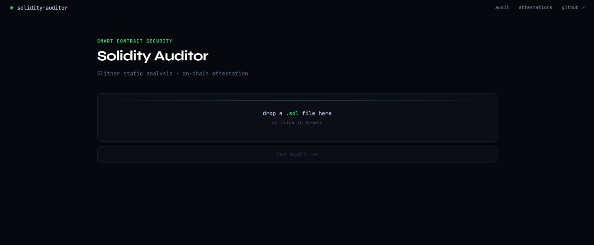
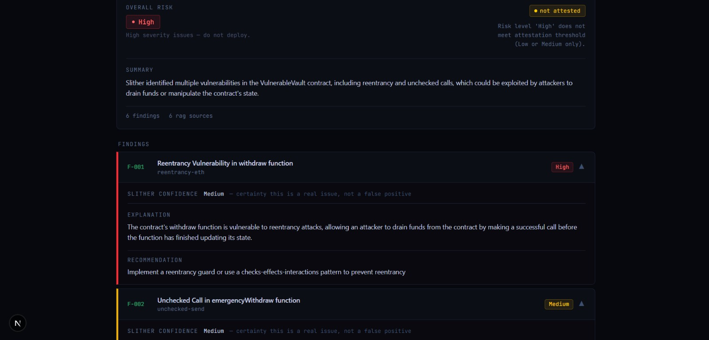
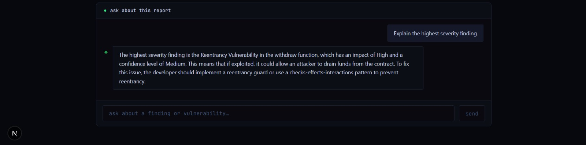
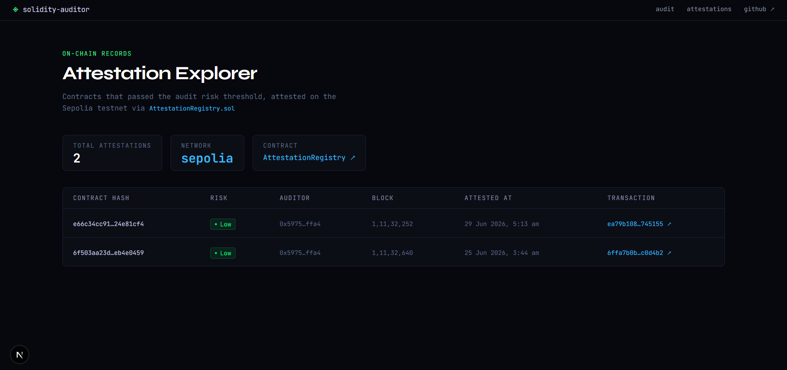

# AI-Powered Smart Contract Auditor

A full-stack security analysis tool that combines deterministic static analysis, retrieval-augmented generation (RAG), and on-chain attestation to audit Solidity smart contracts — built entirely on free tiers, open-source tooling, and locally running models.

---

## Problem Statement

Smart contract vulnerabilities have caused billions of dollars in losses across DeFi, and most of these bugs fall into well-documented, recurring categories (reentrancy, unchecked external calls, integer overflow/underflow, access control flaws). Professional audits are expensive and slow, while purely automated tools like static analyzers produce raw, low-level output that's hard for a non-expert to interpret. There's a gap between "a tool that finds bugs" and "a tool that explains what they mean and what to do about them" — without relying on a paid LLM API or cloud infrastructure.

## Solution

This project closes that gap with a pipeline that:

1. **Runs deterministic static analysis** on an uploaded `.sol` file using Slither, producing ground-truth findings (vulnerability type, severity, location).
2. **Retrieves relevant security context** for each finding from a local knowledge base of 30 curated documents — SWC Registry entries, real-world exploit case studies, and core security concepts — using a Chroma vector store and sentence-transformer embeddings.
3. **Generates a structured, human-readable audit report** by feeding the Slither output and retrieved context into a locally running LLM (Ollama), with the overall risk rating computed deterministically in Python (never by the LLM) to keep the attestation decision trustworthy.
4. **Issues an on-chain attestation** on the Sepolia testnet for contracts that pass a risk threshold, recording the audit hash, risk level, and timestamp permanently and publicly.
5. **Lets the user interrogate the report** through an agentic follow-up chat that can pull finding details or search the knowledge base on demand, rather than just reading the static report.

Every component — the LLM, the vector database, the blockchain network, the backend, and the frontend — runs at zero cost.

---

## Screenshots

### Audit Flow — Home Page


### Audit Report


### Follow-up Chat


### Attestation Explorer


---

## Architecture

```
                         ┌─────────────────────┐
                         │   User (Browser)     │
                         └──────────┬───────────┘
                                    │
                         ┌──────────▼───────────┐
                         │   Next.js Frontend    │
                         │  /  (audit UI)        │
                         │  /attestations (table)│
                         └──────────┬───────────┘
                                    │ REST (local only)
                         ┌──────────▼───────────┐
                         │   FastAPI Backend     │
                         └──┬───────┬───────┬────┘
                            │       │       │
              ┌─────────────┘   ┌───┘   ┌───┘
              ▼                 ▼       ▼
     ┌────────────────┐ ┌──────────┐ ┌─────────────┐
     │ Slither         │ │ Chroma    │ │ Ollama       │
     │ (static analysis│ │ (RAG      │ │ (local LLM,  │
     │ subprocess)     │ │ retrieval)│ │ llama3.2:3b) │
     └────────────────┘ └──────────┘ └─────────────┘
                            │
                            ▼
                  ┌──────────────────┐
                  │  Audit Report     │
                  │  (Pydantic-       │
                  │  validated JSON)  │
                  └─────────┬─────────┘
                            │ if risk ≤ threshold
                            ▼
                 ┌──────────────────────┐
                 │  Supabase (DB)        │◄────┐
                 │  attestation records  │     │ pre-flight
                 └──────────┬────────────┘     │ duplicate check
                            │                   │
                            ▼                   │
                 ┌──────────────────────┐       │
                 │  Sepolia Testnet      │───────┘
                 │  AttestationRegistry  │
                 │  (smart contract)     │
                 └──────────────────────┘
```

**Two distinct flows:**
- **Audit flow** (local only): file upload → Slither → RAG → LLM → report → optional attestation
- **Read flow** (public, deployed): `/attestations` page reads directly from Supabase, no LLM or local backend required

---

## Tech Stack

| Layer | Technology | Why |
|---|---|---|
| Smart contracts | Solidity 0.8.28, Hardhat 2 | Industry-standard tooling, deployed to Sepolia testnet |
| Static analysis | Slither | Deterministic, battle-tested vulnerability detection |
| Vector store | Chroma (local) | Zero-cost, runs in-process, no hosted vector DB needed |
| Embeddings | `all-MiniLM-L6-v2` | Lightweight, CPU-only, no GPU required |
| LLM | Ollama (`llama3.2:3b`, designed for `qwen2.5-coder:7b`) | Fully local inference, no API costs |
| Backend | FastAPI, Pydantic, web3.py | Async-friendly, strong schema validation for LLM output |
| Database | Supabase | Free-tier Postgres with a generous REST API |
| Frontend | Next.js (App Router), TypeScript, Tailwind CSS | Single combined app for both the local audit UI and the public explorer |
| Deployment | Vercel (explorer only) | Free hosting for the read-only, Supabase-backed page |

---

## Key Engineering Decisions

**Deterministic risk scoring, not LLM-decided.** The LLM drafts the narrative report, but `overall_risk` — the value that decides whether a contract gets attested — is computed in Python directly from Slither's impact levels. This keeps the one decision that matters (does this get an on-chain stamp of approval) immune to model hallucination.

**No LangChain or LlamaIndex.** The RAG pipeline is hand-rolled: embed query → query Chroma → format chunks into prompt → call Ollama. This was a deliberate choice to understand every part of the retrieval pipeline rather than relying on framework abstractions.

**Duplicate-attestation protection.** Before submitting any transaction, the backend does a Supabase pre-flight check by contract hash. If a record already exists, it's returned immediately with `already_attested: true` — no gas spent, no on-chain revert risk.

**Split local/public surfaces.** The audit pipeline (Slither + RAG + LLM) only ever runs locally, since it depends on resources (Ollama, Slither) that aren't free to host. The `/attestations` page is read-only against Supabase and is the only piece deployed publicly, on Vercel.

**Agentic chat with explicit tool use.** The follow-up chat doesn't just generate freeform answers — it calls `get_finding_details` or `search_knowledge_base` tools through Ollama's `/api/chat` endpoint, grounding its answers in the actual audit data rather than the model's general knowledge.

---

## Project Structure

```
smart-contract-auditor/
├── hardhat/          # Solidity contracts, deployment scripts (Sepolia)
├── knowledge-base/   # RAG corpus: SWC entries, exploits, concepts → Chroma
├── backend/          # FastAPI: Slither wrapper, RAG, LLM client, blockchain writes
├── explorer/         # Next.js app: audit UI (/) + attestation explorer (/attestations)
└── README.md
```

---

## Getting Started

### Prerequisites
- Node.js, Python 3.10+, Git
- [Ollama](https://ollama.com) installed, with `llama3.2:3b` pulled
- A Sepolia testnet wallet with test ETH and an RPC URL (e.g. via Alchemy)
- A free [Supabase](https://supabase.com) project

### 1. Clone and set up environment variables

```bash
git clone <your-repo-url>
cd smart-contract-auditor
```

Create `.env` at the project root:
```
SEPOLIA_RPC_URL=https://eth-sepolia.g.alchemy.com/v2/YOUR_KEY
DEPLOYER_PRIVATE_KEY=0xYOUR_PRIVATE_KEY
CONTRACT_ADDRESS=0xYOUR_DEPLOYED_CONTRACT_ADDRESS
SUPABASE_URL=https://xxxxxxxxxxxx.supabase.co
SUPABASE_SERVICE_ROLE_KEY=your_service_role_key
DEPLOYMENT_BLOCK=11132252
```

Create `explorer/.env.local`:
```
NEXT_PUBLIC_SUPABASE_URL=https://xxxxxxxxxxxx.supabase.co
NEXT_PUBLIC_SUPABASE_ANON_KEY=your_anon_key
NEXT_PUBLIC_API_URL=http://localhost:8000
```

### 2. Set up the knowledge base

```bash
python -m venv .venv
.venv\Scripts\activate          # Windows
pip install -r requirements.txt
python knowledge-base/scripts/01_chunk.py
python knowledge-base/scripts/02_embed_and_store.py
python knowledge-base/scripts/03_validate.py
```

### 3. Deploy the smart contracts (Sepolia)

```bash
cd hardhat
npm install
npx hardhat run scripts/deploy.js --network sepolia
```
Copy the deployed `AttestationRegistry` address into the root `.env` as `CONTRACT_ADDRESS`.

### 4. Start the backend

```bash
# from project root, with .venv activated
uvicorn backend.main:app --reload --reload-dir backend
```
> The `--reload-dir backend` flag is required — without it, uvicorn watches `knowledge-base/chroma_db/` and hangs on startup.

### 5. Start the frontend

```bash
cd explorer
npm install
npm run dev
```

Visit `http://localhost:3000` for the audit UI, and `http://localhost:3000/attestations` for the explorer.

### 6. Pull the LLM

```bash
ollama pull llama3.2:3b
```

---

## Usage Walkthrough

1. Drag and drop a `.sol` file onto the home page and click **Run Audit**.
2. Slither runs static analysis; results are enriched with retrieved security context and passed to the LLM.
3. A structured report renders with a risk badge, summary, and expandable finding cards.
4. If the contract's risk level is Low/Medium/Informational/Optimization, it's automatically attested on Sepolia and appears in the Attestation Explorer.
5. Use the chat panel below the report to ask follow-up questions — e.g. "explain finding 3" or "what's the fix for reentrancy?"

---

## Known Limitations & Future Work

- Runs `llama3.2:3b` instead of the originally intended `qwen2.5-coder:7b` due to local hardware (16GB RAM, no dedicated GPU) — report quality would improve with a larger model.
- The audit pipeline is local-only by design; only the read-only explorer is publicly deployed.
- Wallet connection (for user-initiated attestation rather than backend-signed transactions) is a natural next step, and would involve migrating from WalletConnect to its successor, Reown.

---
