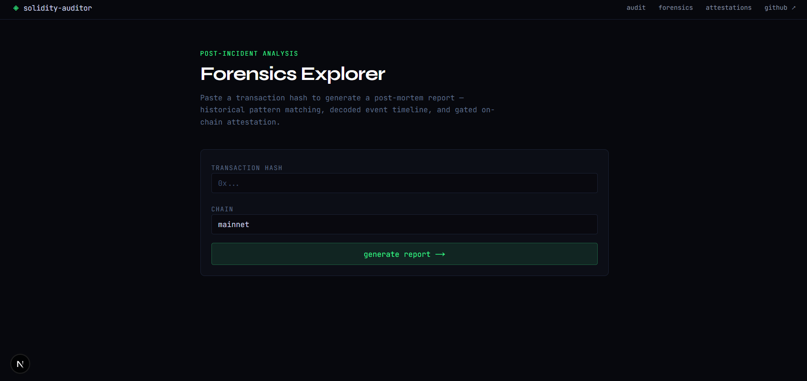
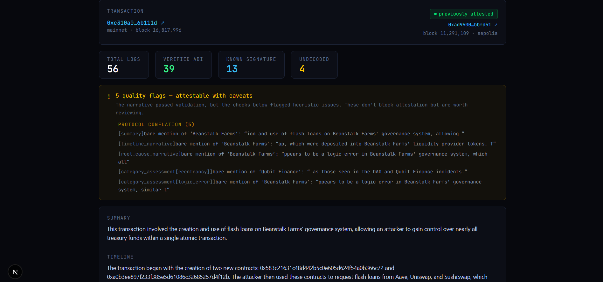
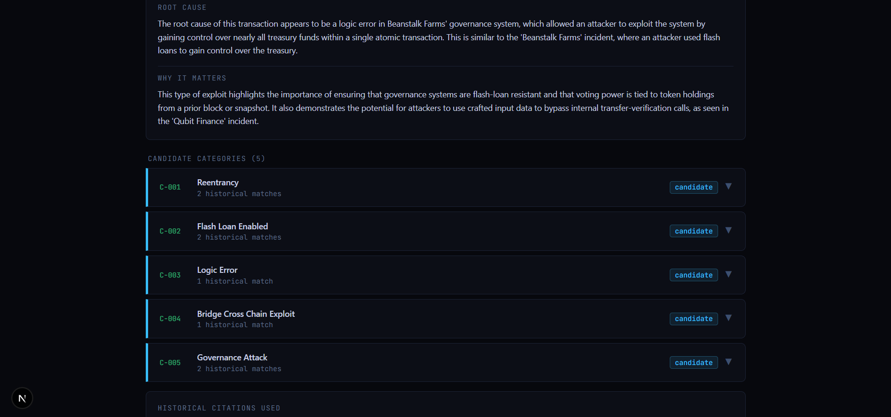

# AI-Powered Smart Contract Auditor

A full-stack security analysis tool that combines deterministic static analysis, retrieval-augmented generation (RAG), and on-chain attestation to audit Solidity smart contracts — built entirely on free tiers, open-source tooling, and locally running models.

> **Update:** this project now includes a **Forensics extension** — post-incident, on-chain analysis of *already-executed* transactions, as a second mode alongside the original pre-deployment auditor. See [Forensics Extension: Post-Incident On-Chain Analysis](#forensics-extension-post-incident-on-chain-analysis) below.

---

## Problem Statement

Smart contract vulnerabilities have caused billions of dollars in losses across DeFi, and most of these bugs fall into well-documented, recurring categories (reentrancy, unchecked external calls, integer overflow/underflow, access control flaws). Professional audits are expensive and slow, while purely automated tools like static analyzers produce raw, low-level output that's hard for a non-expert to interpret. There's a gap between "a tool that finds bugs" and "a tool that explains what they mean and what to do about them" — without relying on a paid LLM API or cloud infrastructure.

## Solution

This project closes that gap with a pipeline that:

1. **Runs deterministic static analysis** on an uploaded `.sol` file using Slither, producing ground-truth findings (vulnerability type, severity, location).
2. **Retrieves relevant security context** for each finding from a local knowledge base of 30 curated documents — SWC Registry entries, real-world exploit case studies, and core security concepts — using a Chroma vector store and sentence-transformer embeddings.
3. **Generates a structured, human-readable audit report** by feeding the Slither output and retrieved context into a locally running LLM (Ollama), with the overall risk rating computed deterministically in Python (never by the LLM) to keep the attestation decision trustworthy.
4. **Issues an on-chain attestation** on the Sepolia testnet for contracts that pass a risk threshold, recording the audit hash, risk level, and timestamp permanently and publicly.
5. **Lets the user interrogate the report** through an agentic follow-up chat that can pull finding details or search the knowledge base on demand, rather than just reading the static report.

Every component — the LLM, the vector database, the blockchain network, the backend, and the frontend — runs at zero cost.

---

## Screenshots

### Audit Flow — Home Page


### Audit Report


### Follow-up Chat


### Attestation Explorer


### Forensics — Landing Page


### Forensics — Report View


### Forensics — Report View


---

## Architecture

```
                         ┌─────────────────────┐
                         │   User (Browser)     │
                         └──────────┬───────────┘
                                    │
                         ┌──────────▼───────────┐
                         │   Next.js Frontend    │
                         │  /  (audit UI)        │
                         │  /attestations (table)│
                         └──────────┬───────────┘
                                    │ REST (local only)
                         ┌──────────▼───────────┐
                         │   FastAPI Backend     │
                         └──┬───────┬───────┬────┘
                            │       │       │
              ┌─────────────┘   ┌───┘   ┌───┘
              ▼                 ▼       ▼
     ┌────────────────┐ ┌──────────┐ ┌─────────────┐
     │ Slither         │ │ Chroma    │ │ Ollama       │
     │ (static analysis│ │ (RAG      │ │ (local LLM,  │
     │ subprocess)     │ │ retrieval)│ │ llama3.2:3b) │
     └────────────────┘ └──────────┘ └─────────────┘
                            │
                            ▼
                  ┌──────────────────┐
                  │  Audit Report     │
                  │  (Pydantic-       │
                  │  validated JSON)  │
                  └─────────┬─────────┘
                            │ if risk ≤ threshold
                            ▼
                 ┌──────────────────────┐
                 │  Supabase (DB)        │◄────┐
                 │  attestation records  │     │ pre-flight
                 └──────────┬────────────┘     │ duplicate check
                            │                   │
                            ▼                   │
                 ┌──────────────────────┐       │
                 │  Sepolia Testnet      │───────┘
                 │  AttestationRegistry  │
                 │  (smart contract)     │
                 └──────────────────────┘
```

**Two distinct flows:**
- **Audit flow** (local only): file upload → Slither → RAG → LLM → report → optional attestation
- **Read flow** (public, deployed): `/attestations` page reads directly from Supabase, no LLM or local backend required

*(See the [Forensics Extension](#forensics-extension-post-incident-on-chain-analysis) section below for the second, independent pipeline added on top of this.)*

---

## Tech Stack

| Layer | Technology | Why |
|---|---|---|
| Smart contracts | Solidity 0.8.28, Hardhat 2 | Industry-standard tooling, deployed to Sepolia testnet |
| Static analysis | Slither | Deterministic, battle-tested vulnerability detection |
| Vector store | Chroma (local) | Zero-cost, runs in-process, no hosted vector DB needed |
| Embeddings | `all-MiniLM-L6-v2` | Lightweight, CPU-only, no GPU required |
| LLM | Ollama (`llama3.2:3b`, designed for `qwen2.5-coder:7b`) | Fully local inference, no API costs |
| Transaction data (forensics) | Etherscan API (free tier) | Fetches real historical tx logs, internal calls, and receipts without running a full node |
| Backend | FastAPI, Pydantic, web3.py | Async-friendly, strong schema validation for LLM output |
| Database | Supabase | Free-tier Postgres with a generous REST API |
| Frontend | Next.js (App Router), TypeScript, Tailwind CSS | Single combined app for both the local audit UI and the public explorer |
| Frontend numeric safety (forensics) | `lossless-json` | Parses the forensics API response without JS silently rounding uint256-range token amounts |
| Deployment | Vercel (explorer only) | Free hosting for the read-only, Supabase-backed page |

---

## Key Engineering Decisions

**Deterministic risk scoring, not LLM-decided.** The LLM drafts the narrative report, but `overall_risk` — the value that decides whether a contract gets attested — is computed in Python directly from Slither's impact levels. This keeps the one decision that matters (does this get an on-chain stamp of approval) immune to model hallucination.

**No LangChain or LlamaIndex.** The RAG pipeline is hand-rolled: embed query → query Chroma → format chunks into prompt → call Ollama. This was a deliberate choice to understand every part of the retrieval pipeline rather than relying on framework abstractions.

**Duplicate-attestation protection.** Before submitting any transaction, the backend does a Supabase pre-flight check by contract hash. If a record already exists, it's returned immediately with `already_attested: true` — no gas spent, no on-chain revert risk.

**Split local/public surfaces.** The audit pipeline (Slither + RAG + LLM) only ever runs locally, since it depends on resources (Ollama, Slither) that aren't free to host. The `/attestations` page is read-only against Supabase and is the only piece deployed publicly, on Vercel.

**Agentic chat with explicit tool use.** The follow-up chat doesn't just generate freeform answers — it calls `get_finding_details` or `search_knowledge_base` tools through Ollama's `/api/chat` endpoint, grounding its answers in the actual audit data rather than the model's general knowledge.

---

## Project Structure

```
smart-contract-auditor/
├── hardhat/                          # Solidity contracts, deployment scripts (Sepolia)
│   ├── contracts/
│   │   ├── AttestationRegistry.sol           # base auditor
│   │   └── ForensicsAttestationRegistry.sol  # forensics extension
│   └── scripts/
│       ├── deploy.js
│       └── deploy-forensics.js
├── knowledge-base/                   # RAG corpora → Chroma
│   ├── raw/                          # SWC entries, exploits, concepts (audit)
│   ├── processed/
│   ├── forensics/raw/incidents/      # 31 historical exploit write-ups (forensics)
│   ├── forensics/processed/
│   └── forensics-scripts/            # chunk / embed / validate for the forensics corpus
├── backend/                          # FastAPI: Slither wrapper, RAG, LLM client, blockchain writes
│   ├── main.py                       # audit endpoints + forensics endpoints
│   ├── retrieval.py, ollama_client.py, blockchain.py, chat.py
│   ├── etherscan_client.py           # forensics: Etherscan ingestion
│   ├── forensics_ingest.py, log_decoder.py, timeline_builder.py
│   ├── query_builder.py, attack_pattern_scoring.py
│   ├── forensics_prompt_builder.py, forensics_report_generator.py
│   └── blockchain_forensics_reconcile.py   # one-off Supabase backfill tool
├── explorer/                         # Next.js app
│   ├── app/
│   │   ├── page.tsx                       # audit UI
│   │   ├── attestations/page.tsx          # audit attestation explorer
│   │   ├── forensics/page.tsx             # forensics landing page (tx hash input)
│   │   └── forensics/[txHash]/page.tsx    # forensics report view + attest
│   ├── components/                        # AuditReport, FindingCard, RiskBadge,
│   │   │                                  # ForensicsReportView, DecodeSummaryStrip,
│   │   │                                  # QualityFlagsPanel, CategoryAssessmentCard
│   └── lib/                               # types.ts, api.ts, parseLosslessJson.ts
└── README.md
```

---

## Getting Started

### Prerequisites
- Node.js, Python 3.10+, Git
- [Ollama](https://ollama.com) installed, with `llama3.2:3b` pulled
- A Sepolia testnet wallet with test ETH and an RPC URL (e.g. via Alchemy)
- A free [Supabase](https://supabase.com) project
- A free [Etherscan API key](https://etherscan.io/apis) (forensics extension only)

### 1. Clone and set up environment variables

```bash
git clone <your-repo-url>
cd smart-contract-auditor
```

Create `.env` at the project root:
```
SEPOLIA_RPC_URL=https://eth-sepolia.g.alchemy.com/v2/YOUR_KEY
DEPLOYER_PRIVATE_KEY=0xYOUR_PRIVATE_KEY
CONTRACT_ADDRESS=0xYOUR_DEPLOYED_CONTRACT_ADDRESS
SUPABASE_URL=https://xxxxxxxxxxxx.supabase.co
SUPABASE_SERVICE_ROLE_KEY=your_service_role_key
DEPLOYMENT_BLOCK=11132252
ETHERSCAN_API_KEY=your_etherscan_api_key                      # forensics extension
FORENSICS_CONTRACT_ADDRESS=0xYOUR_DEPLOYED_FORENSICS_ADDRESS   # forensics extension
```

Create `explorer/.env.local`:
```
NEXT_PUBLIC_SUPABASE_URL=https://xxxxxxxxxxxx.supabase.co
NEXT_PUBLIC_SUPABASE_ANON_KEY=your_anon_key
NEXT_PUBLIC_API_URL=http://localhost:8000
```

### 2. Set up the knowledge base

```bash
python -m venv .venv
.venv\Scripts\activate          # Windows
pip install -r requirements.txt
python knowledge-base/scripts/01_chunk.py
python knowledge-base/scripts/02_embed_and_store.py
python knowledge-base/scripts/03_validate.py
```

### 3. Deploy the smart contracts (Sepolia)

```bash
cd hardhat
npm install
npx hardhat run scripts/deploy.js --network sepolia
```
Copy the deployed `AttestationRegistry` address into the root `.env` as `CONTRACT_ADDRESS`.

### 4. Start the backend

```bash
# from project root, with .venv activated
uvicorn backend.main:app --reload --reload-dir backend
```
> The `--reload-dir backend` flag is required — without it, uvicorn watches `knowledge-base/chroma_db/` and hangs on startup.

### 5. Start the frontend

```bash
cd explorer
npm install
npm run dev
```

Visit `http://localhost:3000` for the audit UI, and `http://localhost:3000/attestations` for the explorer.

### 6. Pull the LLM

```bash
ollama pull llama3.2:3b
```

### 7. (Optional) Set up the forensics extension

Build the historical exploit corpus:
```bash
python knowledge-base/forensics-scripts/01_chunk.py
python knowledge-base/forensics-scripts/02_embed_and_store.py
python knowledge-base/forensics-scripts/03_validate.py
```

Deploy the forensics attestation contract:
```bash
cd hardhat
npx hardhat run scripts/deploy-forensics.js --network sepolia
```
Copy the deployed address into the root `.env` as `FORENSICS_CONTRACT_ADDRESS`.

Create the `forensics_attestations` table in Supabase (SQL Editor):
```sql
create table forensics_attestations (
    id uuid primary key default gen_random_uuid(),
    tx_hash text unique not null,
    chain text not null,
    chain_id integer not null,
    attestor_address text not null,
    category_bitmask integer not null,
    has_conflation_flags boolean not null,
    report_hash text not null,
    attestation_tx_hash text not null,
    block_number integer not null,
    attested_at timestamptz not null
);
alter table forensics_attestations enable row level security;
```

Install the frontend's big-number-safe JSON parser:
```bash
cd explorer
npm install lossless-json
```

Visit `http://localhost:3000/forensics` to use the forensics explorer.

---

## Usage Walkthrough

### Audit
1. Drag and drop a `.sol` file onto the home page and click **Run Audit**.
2. Slither runs static analysis; results are enriched with retrieved security context and passed to the LLM.
3. A structured report renders with a risk badge, summary, and expandable finding cards.
4. If the contract's risk level is Low/Medium/Informational/Optimization, it's automatically attested on Sepolia and appears in the Attestation Explorer.
5. Use the chat panel below the report to ask follow-up questions — e.g. "explain finding 3" or "what's the fix for reentrancy?"

### Forensics
1. Go to `/forensics` and paste a transaction hash (mainnet or the chain your Etherscan key supports), then click **Generate Report**.
2. The pipeline fetches the transaction, decodes its event logs, retrieves the most similar historical incidents from the exploit corpus, and generates a narrative — this can take a couple of minutes on CPU.
3. The report page shows a decode summary, any protocol-conflation or fabricated-evidence quality flags, the narrative (summary / timeline / root cause / why it matters), and one expandable card per candidate attack category with its historical matches.
4. If the narrative passed validation, an **Attest On-Chain** button appears. Clicking it submits *exactly the report you're looking at* — not a freshly regenerated one — for gated attestation on Sepolia (see [Real Bugs Found & Fixed](#real-bugs-found--fixed) below for why that distinction matters).
5. Visiting a `/forensics/[txHash]` link directly (e.g. a shared URL) re-runs the pipeline fresh rather than reading a cached report — see [Known Limitations](#known-limitations-1) below.

---

## Known Limitations & Future Work

- Runs `llama3.2:3b` instead of the originally intended `qwen2.5-coder:7b` due to local hardware (16GB RAM, no dedicated GPU) — report quality would improve with a larger model.
- The audit pipeline is local-only by design; only the read-only explorer is publicly deployed.
- Wallet connection (for user-initiated attestation rather than backend-signed transactions) is a natural next step, and would involve migrating from WalletConnect to its successor, Reown.

---

## Forensics Extension: Post-Incident On-Chain Analysis

The forensics extension adds a second, independent mode to the auditor: instead of analyzing a contract *before* deployment, it takes a transaction hash for an incident that has *already happened* and generates a structured post-mortem — historical pattern matching against 31 real-world exploits, a decoded event timeline, and its own separate on-chain attestation trail.

### Problem Statement

Post-incident analysis of DeFi exploits today is almost entirely manual: someone reads Etherscan, cross-references it against writeups of past hacks they happen to remember, and publishes a Twitter thread or a blog post. There's no structured, repeatable way to ask "does this transaction resemble a known attack pattern, and which one" — and no way to make that analysis independently verifiable after the fact, the way the pre-deployment audit side already does with attestation.

### Solution / Pipeline

1. **Ingest** the transaction from Etherscan — the main transaction, its internal call sequence, and its full log sequence, decoding events via verified ABIs where available and known signatures otherwise.
2. **Retrieve** the most similar historical incidents from a dedicated ChromaDB collection (`historical_exploits`) built from 31 curated exploit write-ups, kept entirely separate from the audit side's vulnerability corpus.
3. **Score** the transaction against a fixed 9-category attack taxonomy, combining retrieval similarity with any direct on-chain signals.
4. **Generate** a narrative (summary, timeline, root cause, why-it-matters, and a per-category assessment) via the same local Ollama model used for audits — then validate it, checking for fabricated evidence and bare protocol-name conflation before it's ever shown as trustworthy.
5. **Attest** the report on-chain, gated on that validation passing, via a dedicated `ForensicsAttestationRegistry` contract.

### Attack Taxonomy

A fixed, ordered list of 9 categories, encoded as a `uint16` bitmask on-chain (since a real incident can — and often does — match more than one category simultaneously, unlike the audit side's single overall risk level):

```
0. reentrancy
1. oracle_manipulation
2. flash_loan_enabled
3. access_control_failure
4. logic_error
5. front_running_mev
6. signature_replay_verification_bypass
7. bridge_cross_chain_exploit
8. governance_attack
```

### On-Chain Attestation & Gating Logic

The `ForensicsAttestationRegistry` contract records, per transaction hash: the chain ID, attestor, timestamp, a hash of the full report, the category bitmask, and a single `hasConflationFlags` boolean. All gating is enforced in Python before submission — the contract simply records what's already been decided:

- **`narrative_validation_failed = true` → hard block.** This is treated as a correctness failure, not a severity gradient, and is never attestable.
- **Quality flags (protocol conflation or fabricated evidence) → warn, but still attest.** These are documented heuristics with known false positives/negatives; blocking on them would deny legitimate reports. Both checks are OR'd into the single on-chain `hasConflationFlags` bit to avoid a contract redeploy — full detail (which check fired, on which field) remains visible in the API response and the report itself, only the single on-chain bit loses the distinction between the two.

### Key Engineering Decisions

**Attest exactly what was reviewed, not what gets regenerated.** `/forensics/attest` accepts an already-generated report and attests it as-is, rather than silently re-running the LLM pipeline. This was a deliberate fix (see bug #5 below) once it became clear the narrative isn't deterministic run-to-run — regenerating at attest time could otherwise put a different report on-chain than the one a user actually reviewed, undermining the entire point of attestation.

**Category bitmask, not a single label.** Unlike the audit side's single `overall_risk`, a real incident can simultaneously be, say, a flash-loan-enabled governance attack — both tags legitimately apply. The 9-category order is fixed and treated as a permanent on-chain contract, not an implementation detail that can silently change.

**Separate phase counter, separate corpus, separate registry — same repo.** Rather than spinning up a new project, the forensics extension shares the base auditor's repo, environment, and LLM, but keeps its ChromaDB collection, contract, Supabase table, and phase numbering independent, so the two modes can evolve without risk of cross-contamination.

**Dual-invocation-safe imports.** Several forensics modules can be run either as part of the FastAPI app (`backend.X` package imports) or standalone for smoketesting (`cd backend; python X.py`, flat imports). A try/except import fallback pattern supports both without duplicating any module that holds meaningful state (notably `retrieval.py`'s ChromaDB client) — see bug #3 below for why that mattered.

### Real Bugs Found & Fixed

Documented here in the same spirit as the audit side's own known limitations — these were caught through live testing against a real Sepolia transaction, not hypothesized in advance.

1. **Gas limit too low.** The forensics attestation call initially copied the audit side's hardcoded gas limit. It reverted on Sepolia with an out-of-gas error, since `ForensicsAttestation`'s struct has more fields than the audit side's. Fixed by estimating gas dynamically (`estimate_gas()` + a 30% buffer) instead of guessing a new fixed number.
2. **Receipt-wait timeout too short.** A real Sepolia confirmation, under low ambient gas prices, took longer than an initial 120-second timeout, even though it eventually mined successfully. Fixed by raising the timeout to 300 seconds, plus writing a one-off reconciliation script to backfill Supabase for the one attestation that had already confirmed late.
3. **Import module duplication risk.** A forensics module using flat sibling imports, if loaded through the FastAPI app's package-style imports, would have caused Python to load `retrieval.py` a second time under a different module name — creating a second, separate ChromaDB client against the same on-disk path in one process, with a real risk of "database is locked" errors. Caught by reasoning through the import graph before it caused a live failure, and fixed with a try/except import fallback pattern.
4. **LLM fabricating "direct evidence" claims.** A sparse test transaction with zero decoded logs still produced category assessments tagged as directly observed evidence — but the LLM was actually describing a retrieved historical incident's specifics as if it had seen them in the analyzed transaction itself. This is a stricter failure than simple protocol-name conflation: it asserts a false fact about the transaction's own evidence, not just borrows a name. Fixed by cross-checking every "direct evidence" claim in the narrative against that category's actual detected signals, flagging any mismatch.
5. **Non-deterministic attest-time regeneration.** `/forensics/attest` originally re-ran the full pipeline independently of `/forensics/generate`, rather than reusing whatever the user had already reviewed. Since the LLM narrative isn't deterministic run-to-run, this meant the report a user reviewed in the explorer UI could differ from the one that actually got attested on-chain — silently breaking the core trust guarantee that attestation is supposed to provide. Fixed by having `/forensics/attest` accept an already-generated report directly (validated for matching tx hash, chain, and schema version) and attest it as-is, only falling back to full regeneration for standalone/scripted use where no prior report exists.

### Explorer UI

Two new routes, in the same visual language as the audit side:

- **`/forensics`** — a landing page for entering a transaction hash and chain, which redirects to the report route on submission.
- **`/forensics/[txHash]`** — the report view: a decode summary strip, a quality-flags panel (shown only when flags are present), the full narrative, one expandable card per candidate category with its historical matches, and — if validation passed — an **Attest On-Chain** button.

Because uint256-range token amounts inside decoded log arguments (e.g. transfer amounts, protocol balances) exceed what a JS `number` can represent exactly, the forensics API responses are parsed with `lossless-json` rather than the browser's native `JSON.parse`, converting only the fields that would otherwise silently lose precision into exact strings.

### Known Limitations

- `/forensics/[txHash]` re-runs the full pipeline on every visit rather than reading a cached report — neither the on-chain record nor the Supabase table stores the full report JSON, only its hash and category bitmask. This means a shared report link, or a page refresh, can show a slightly different narrative (different quality-flag count, different citations) than an earlier visit, even though nothing about the transaction itself has changed. This mirrors an existing limitation on the audit side, where `Attestation` records similarly don't store the full report.
- The `hasConflationFlags` on-chain bit conflates two distinct checks (protocol conflation and fabricated evidence) into one boolean to avoid a contract redeploy; the full, separated detail remains available in the report and API response.
- `pattern_scores[category].direct_signals` and the shape of a populated `fabricated_evidence_flags` entry are both based on code inspection rather than a real-world example with actual data in them — every transaction analyzed so far has left both empty. Worth revisiting if a genuinely fabricated-evidence case shows up in practice.
- Etherscan's free-tier rate limits constrain how quickly a freshly-specified transaction can be ingested.

---